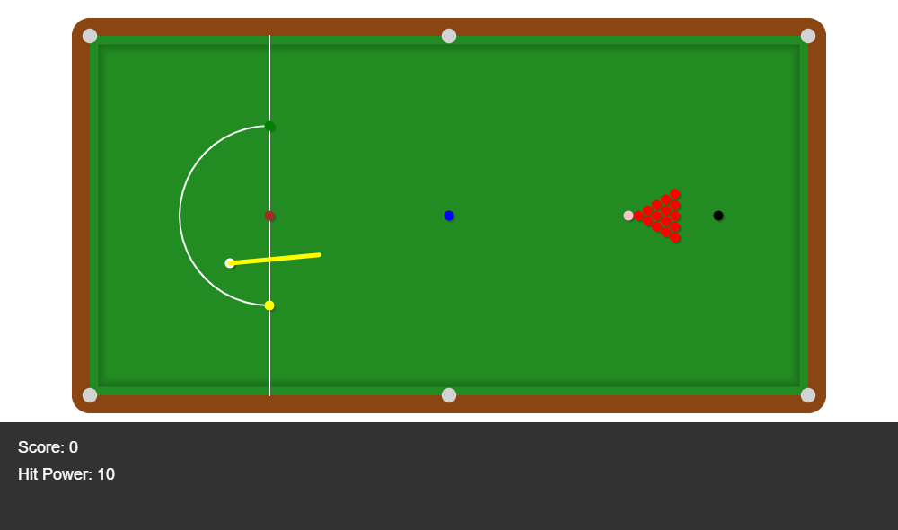
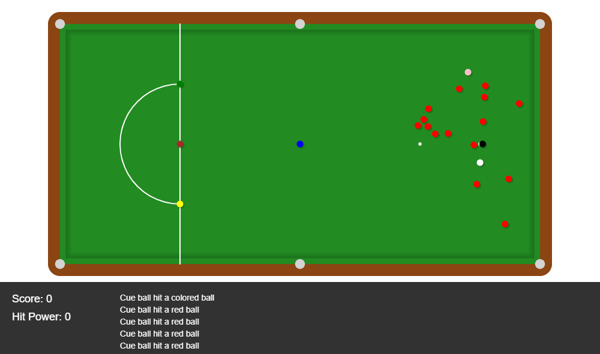

# Snooker Game

A top-down snooker game for the browser. Ball physics run on **Matter.js** and rendering on **p5.js**.

  
  

## Features

- **Physics:** ball-to-ball collisions, cushion rebounds, friction and restitution. Pockets are Matter.js sensor bodies.
- **3 game modes:** standard setup, random reds, or all balls random (random placement never overlaps balls)
- **Tutorial mode:** 5 guided steps that highlight the D zone, cue, power and target balls
- **Rules:**
  - Potted reds stay down.
  - Potted colours are re-spotted: to their original spot in modes 1 and 2, to a random free spot in mode 3.
  - A potted cue ball must be placed back inside the D.
- **Scoring:** red +1, colour +2, potted cue ball −1
- **Feedback:** sound effects for collisions and pots, plus live messages such as "Cue ball hit a red ball"

## Controls

| Action | Control |
|---|---|
| Place cue ball (inside the D) | Click |
| Aim | Move mouse |
| Shot power | ↑ / ↓ |
| Shoot | Space or click |
| Game mode | `1` `2` `3` |
| Next tutorial step | `4` |

## Tech Stack

JavaScript · p5.js · p5.sound · Matter.js

## Run

Open `index.html` with the VS Code **Live Server** extension.

## Author

Ziad Elhussein
